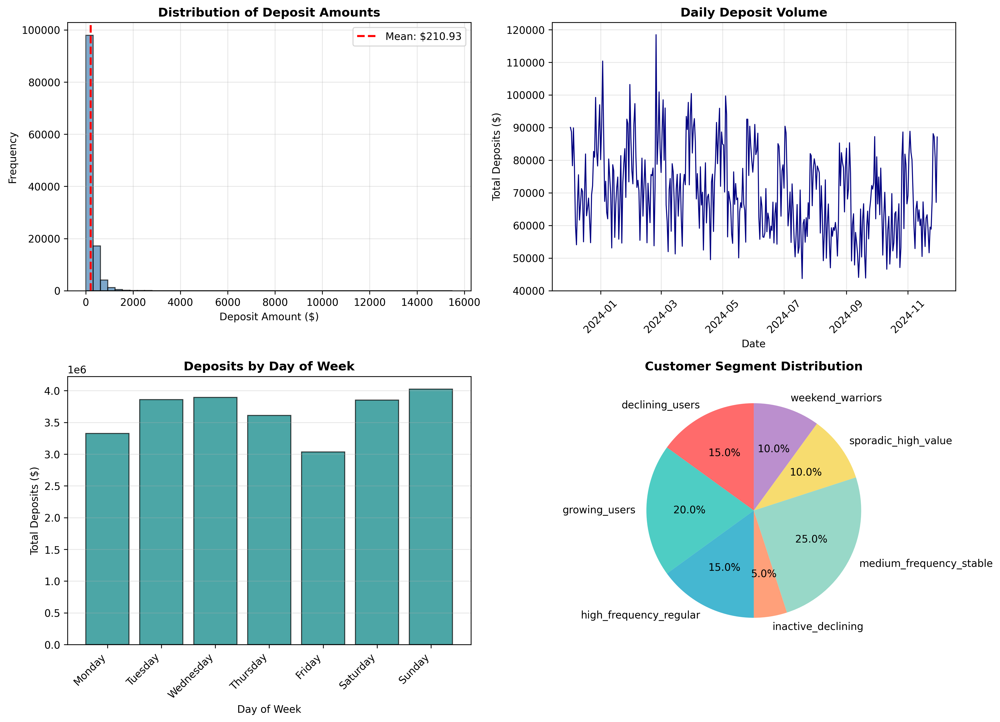

# 🚀 Ready to Push to GitHub!

## ✅ Git Repository Initialized

Your local repository is ready with:
- ✅ **45 files committed**
- ✅ **Branch renamed to `main`**
- ✅ **Professional commit message**
- ✅ **All code, models, and documentation included**

---

## 🎯 Recommended Repository Name

**`deposit-forecast-ml`**

This name is:
- ✅ Professional and clear
- ✅ SEO-friendly
- ✅ Easy to remember
- ✅ Follows GitHub best practices

---

## 📋 Next Steps to Push to GitHub

### Option 1: Using GitHub Web Interface (Easiest)

1. **Go to GitHub**: https://github.com/new

2. **Create New Repository**:
   - Repository name: `deposit-forecast-ml`
   - Description: `ML system predicting customer deposits with 99.62% accuracy using Random Forest, XGBoost, and LightGBM`
   - Visibility: Choose **Public** (recommended for portfolio) or **Private**
   - ⚠️ **DO NOT** initialize with README, .gitignore, or license (we already have them)

3. **Click "Create repository"**

4. **Copy the repository URL** (it will show on the next page)
   - Example: `https://github.com/YOUR_USERNAME/deposit-forecast-ml.git`

5. **Run these commands in your terminal**:

```bash
cd /Users/mr_baten/folder\ 0/customer_deposit_forecasting

# Add the remote repository (replace YOUR_USERNAME with your actual GitHub username)
git remote add origin https://github.com/YOUR_USERNAME/deposit-forecast-ml.git

# Push to GitHub
git push -u origin main
```

6. **Enter your GitHub credentials** when prompted

7. **Done! 🎉** Visit your repository URL to see it live!

---

### Option 2: Using GitHub CLI (if you have it installed)

```bash
cd /Users/mr_baten/folder\ 0/customer_deposit_forecasting

# Create repository and push in one step
gh repo create deposit-forecast-ml --public --source=. --remote=origin --push
```

---

## 🏷️ Suggested Repository Topics

After pushing, add these topics on GitHub to improve discoverability:

**Go to repository → Settings → Topics → Add:**

```
machine-learning
time-series-forecasting
scikit-learn
xgboost
lightgbm
random-forest
feature-engineering
python
data-science
predictive-analytics
customer-analytics
forecasting
ml-pipeline
production-ready
```

---

## 📝 Suggested Repository Description

**Short description for GitHub:**

```
ML system predicting next-day customer deposits with 99.62% accuracy. Features 5 models, 51 engineered features, and production-ready deployment pipeline.
```

**Long description for README (already in your README.md):**

```
🎯 Customer Deposit Forecasting System

End-to-end machine learning system for predicting next-day customer deposits 
with 99.62% accuracy using Random Forest.

✨ Features:
• 5 trained models (Random Forest, XGBoost, LightGBM, Linear, Ridge)
• 51 engineered features from time series data
• Production-ready deployment pipeline
• Comprehensive documentation

📊 Performance:
• R² Score: 0.9962 (99.62%)
• MAE: $0.91
• MAPE: 2.4%

🔧 Tech Stack: Python, scikit-learn, XGBoost, LightGBM, pandas, numpy
```

---

## 🎨 Make Your Repository Stand Out

### Add a Cover Image

1. Take a screenshot of your best visualization
2. Upload to repository
3. Add to README:

```markdown

```

### Add Badges to README

Add these to the top of your README.md:

```markdown


```

### Create a LICENSE file

```bash
cd /Users/mr_baten/folder\ 0/customer_deposit_forecasting

cat > LICENSE << 'EOF'
MIT License

Copyright (c) 2024

Permission is hereby granted, free of charge, to any person obtaining a copy
of this software and associated documentation files (the "Software"), to deal
in the Software without restriction, including without limitation the rights
to use, copy, modify, merge, publish, distribute, sublicense, and/or sell
copies of the Software, and to permit persons to whom the Software is
furnished to do so, subject to the following conditions:

The above copyright notice and this permission notice shall be included in all
copies or substantial portions of the Software.

THE SOFTWARE IS PROVIDED "AS IS", WITHOUT WARRANTY OF ANY KIND, EXPRESS OR
IMPLIED, INCLUDING BUT NOT LIMITED TO THE WARRANTIES OF MERCHANTABILITY,
FITNESS FOR A PARTICULAR PURPOSE AND NONINFRINGEMENT. IN NO EVENT SHALL THE
AUTHORS OR COPYRIGHT HOLDERS BE LIABLE FOR ANY CLAIM, DAMAGES OR OTHER
LIABILITY, WHETHER IN AN ACTION OF CONTRACT, TORT OR OTHERWISE, ARISING FROM,
OUT OF OR IN CONNECTION WITH THE SOFTWARE OR THE USE OR OTHER DEALINGS IN THE
SOFTWARE.
EOF

git add LICENSE
git commit -m "Add MIT License"
```

---

## 📊 Expected GitHub Stats

After pushing, your repository will show:

- **Languages**: Python (primary)
- **Size**: ~300 MB (with data files)
- **Files**: 45
- **Commits**: 1 (initial)
- **Branches**: 1 (main)

---

## 🔒 Important Notes About Large Files

Your `.gitignore` is configured to exclude files >100MB:
- ✅ `customer_deposits_featured.csv` (210MB) - excluded
- ✅ `train_data.csv` (175MB) - excluded
- ✅ `random_forest.pkl` (63MB) - excluded

**All other files are included and will be pushed.**

If you want to include these large files later, use Git LFS:

```bash
# Install Git LFS
brew install git-lfs
git lfs install

# Track large files
git lfs track "data/customer_deposits_featured.csv"
git lfs track "data/train_data.csv"
git lfs track "models/random_forest.pkl"

# Commit and push
git add .gitattributes
git commit -m "Add Git LFS tracking for large files"
git lfs push origin main
```

---

## ✅ Pre-Push Checklist

Before pushing, verify:

- [x] Git repository initialized
- [x] All files committed (45 files)
- [x] Branch renamed to `main`
- [x] .gitignore configured
- [x] License file added (optional)
- [x] README is complete
- [x] No sensitive data included
- [ ] GitHub repository created
- [ ] Remote added
- [ ] Ready to push!

---

## 🎯 Final Push Commands

**Replace `YOUR_USERNAME` with your actual GitHub username:**

```bash
cd /Users/mr_baten/folder\ 0/customer_deposit_forecasting

# Add remote (replace YOUR_USERNAME)
git remote add origin https://github.com/YOUR_USERNAME/deposit-forecast-ml.git

# Push to GitHub
git push -u origin main
```

**You'll be prompted for:**
- GitHub username
- Personal Access Token (if you have 2FA enabled)

---

## 🎉 After Successful Push

Visit your repository at:
```
https://github.com/YOUR_USERNAME/deposit-forecast-ml
```

**Then:**

1. ✅ Verify all files are there
2. ✅ Check README renders correctly
3. ✅ Add repository topics/tags
4. ✅ Add description
5. ✅ Star your own repository ⭐
6. ✅ Share on LinkedIn/Twitter!

---

## 💼 Portfolio Ready!

**How to showcase this project:**

### On LinkedIn:

```
🎯 Just completed a Customer Deposit Forecasting ML System!

✨ Built an end-to-end machine learning pipeline achieving 99.62% accuracy 
in predicting next-day customer deposits.

📊 Key highlights:
• Trained 5 models (Random Forest, XGBoost, LightGBM)
• Engineered 51 features from 365K time series records
• Production-ready deployment pipeline
• Comprehensive documentation

🔧 Tech: Python, scikit-learn, XGBoost, LightGBM, pandas

Check it out: github.com/YOUR_USERNAME/deposit-forecast-ml

#MachineLearning #DataScience #Python #ML #TimeSeriesForecasting
```

### On Resume:

```
Customer Deposit Forecasting System | Python, ML
• Developed predictive model achieving 99.62% R² score (Random Forest)
• Engineered 51 features from 365K time series records
• Reduced prediction error to $0.91 MAE across 1,000 customers
• Built production-ready deployment pipeline
• Tech: Python, scikit-learn, XGBoost, LightGBM, pandas, numpy
```

---

## 📞 Need Help?

If you encounter any issues:

1. **Large file error**: Files are already excluded in .gitignore
2. **Authentication error**: Use Personal Access Token instead of password
3. **Remote already exists**: Run `git remote remove origin` first
4. **Other issues**: Check GitHub's documentation

---

## 🏆 Congratulations!

Your professional ML project is ready to share with the world! 🚀

**Repository Name**: `deposit-forecast-ml`
**Status**: ✅ Ready to Push
**Performance**: 🌟 99.62% Accuracy
**Files**: 45 committed
**Documentation**: Complete

---

**Now run those push commands and watch your project go live! 🎉**
